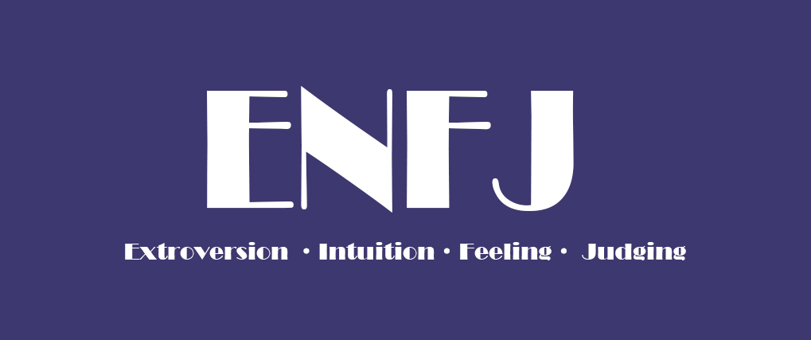

## About Me

- ENFJ stands for: extroversion (E)+ intuition (N)+ emotion (F)+ judgment (J). 
- ENFJ refers to the supplier.
-  Supply is the act of providing others with daily necessities. 
- Suppliers are naturally keen on serving others to ensure that they have a sense of material sufficiency and group belonging.

